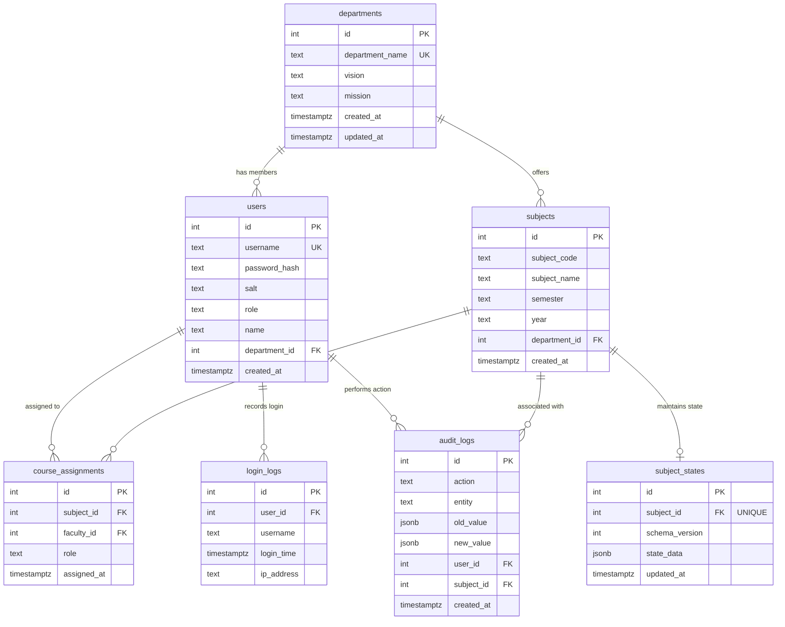

# PostgreSQL Database Schema Documentation

This document describes the schema architecture, relationships, constraints, and tables in the PostgreSQL database for the Multi-Agent CO-PO ERP system.

---

## 1. Entity-Relationship Model (Mermaid Diagram)



---

## 2. Table Specifications

### 2.1 `departments`
Stores academic department metadata (e.g., Computer Engineering).

| Column Name | Data Type | Constraints / Default | Description |
| :--- | :--- | :--- | :--- |
| `id` | `SERIAL` | `PRIMARY KEY` | Unique auto-incrementing ID |
| `department_name` | `TEXT` | `UNIQUE NOT NULL` | Name of the academic department |
| `vision` | `TEXT` | `NOT NULL DEFAULT ''` | Long-term vision statement |
| `mission` | `TEXT` | `NOT NULL DEFAULT ''` | Core mission statements |
| `created_at` | `TIMESTAMPTZ` | `NOT NULL DEFAULT NOW()` | Record creation timestamp |
| `updated_at` | `TIMESTAMPTZ` | `NOT NULL DEFAULT NOW()` | Record modification timestamp |

---

### 2.2 `users`
Stores user profile information, role-based access levels, and credentials.

| Column Name | Data Type | Constraints / Default | Description |
| :--- | :--- | :--- | :--- |
| `id` | `SERIAL` | `PRIMARY KEY` | Unique auto-incrementing ID |
| `username` | `TEXT` | `UNIQUE NOT NULL` | Unique login handle |
| `password_hash` | `TEXT` | `NOT NULL` | SHA-256 password hash |
| `salt` | `TEXT` | `NOT NULL` | Secure salt value |
| `role` | `TEXT` | `NOT NULL CHECK (role IN ('admin', 'course_champion', 'course_faculty'))` | RBAC role |
| `name` | `TEXT` | `NOT NULL` | Full name of the user |
| `department_id` | `INTEGER` | `REFERENCES departments(id) ON DELETE SET NULL` | Linked department |
| `created_at` | `TIMESTAMPTZ` | `NOT NULL DEFAULT NOW()` | Account creation timestamp |

---

### 2.3 `subjects`
Stores course details mapped to departments.

| Column Name | Data Type | Constraints / Default | Description |
| :--- | :--- | :--- | :--- |
| `id` | `SERIAL` | `PRIMARY KEY` | Unique auto-incrementing ID |
| `subject_code` | `TEXT` | `NULL` | e.g. CS301 |
| `subject_name` | `TEXT` | `NOT NULL` | Title of the subject / course |
| `semester` | `TEXT` | `NOT NULL DEFAULT ''` | Target semester |
| `year` | `TEXT` | `NOT NULL` | Academic year (e.g., "2025-26") |
| `department_id` | `INTEGER` | `REFERENCES departments(id) ON DELETE CASCADE` | Linked department |
| `created_at` | `TIMESTAMPTZ` | `NOT NULL DEFAULT NOW()` | Subject entry creation time |

* **Composite Constraint:** `UNIQUE(subject_name, year, department_id)`

---

### 2.4 `course_assignments`
Maps faculty members to subjects, along with their assigned role.

| Column Name | Data Type | Constraints / Default | Description |
| :--- | :--- | :--- | :--- |
| `id` | `SERIAL` | `PRIMARY KEY` | Unique auto-incrementing ID |
| `subject_id` | `INTEGER` | `NOT NULL REFERENCES subjects(id) ON DELETE CASCADE` | Assigned subject |
| `faculty_id` | `INTEGER` | `NOT NULL REFERENCES users(id) ON DELETE CASCADE` | Assigned user |
| `role` | `TEXT` | `NOT NULL CHECK (role IN ('COURSE_CHAMPION', 'COURSE_FACULTY'))` | Role within the course context |
| `assigned_at` | `TIMESTAMPTZ` | `NOT NULL DEFAULT NOW()` | Date/time of assignment |

* **Composite Constraint:** `UNIQUE(subject_id, faculty_id)`

---

### 2.5 `subject_states`
Stores the flexible, evolving AI agent state data (such as generated COs, program outcomes, student marks rosters, mappings, and attainments) inside a native `JSONB` column.

| Column Name | Data Type | Constraints / Default | Description |
| :--- | :--- | :--- | :--- |
| `id` | `SERIAL` | `PRIMARY KEY` | Unique auto-incrementing ID |
| `subject_id` | `INTEGER` | `UNIQUE NOT NULL REFERENCES subjects(id) ON DELETE CASCADE` | Associated subject |
| `schema_version` | `INTEGER` | `NOT NULL DEFAULT 1` | Version of state schema |
| `state_data` | `JSONB` | `NOT NULL DEFAULT '{}'` | Serialized state JSON blob |
| `updated_at` | `TIMESTAMPTZ` | `NOT NULL DEFAULT NOW()` | Time of last state change |

* **Index:** `idx_subject_states_data` (GIN index on `state_data` for rapid search of JSON fields).

---

### 2.6 `login_logs`
Logs login attempts for security auditing.

| Column Name | Data Type | Constraints / Default | Description |
| :--- | :--- | :--- | :--- |
| `id` | `SERIAL` | `PRIMARY KEY` | Unique auto-incrementing ID |
| `user_id` | `INTEGER` | `REFERENCES users(id) ON DELETE SET NULL` | Linked user account |
| `username` | `TEXT` | `NOT NULL` | Login identifier used |
| `login_time` | `TIMESTAMPTZ` | `NOT NULL DEFAULT NOW()` | Log timestamp |
| `ip_address` | `TEXT` | `NULL` | Source client IP address |

---

### 2.7 `audit_logs`
Logs details of administrative actions (e.g., finalizations, mark uploads, exports) along with before-and-after snapshots.

| Column Name | Data Type | Constraints / Default | Description |
| :--- | :--- | :--- | :--- |
| `id` | `SERIAL` | `PRIMARY KEY` | Unique auto-incrementing ID |
| `action` | `TEXT` | `NOT NULL` | Action code (e.g. `GENERATE_CO`, `UPLOAD_MARKS`) |
| `entity` | `TEXT` | `NULL` | Targeted scope (e.g. `course_outcomes`) |
| `old_value` | `JSONB` | `NULL` | JSON state snapshot before modification |
| `new_value` | `JSONB` | `NULL` | JSON state snapshot after modification |
| `user_id` | `INTEGER` | `REFERENCES users(id) ON DELETE SET NULL` | User who initiated action |
| `subject_id` | `INTEGER` | `REFERENCES subjects(id) ON DELETE SET NULL` | Subject impacted |
| `created_at` | `TIMESTAMPTZ` | `NOT NULL DEFAULT NOW()` | Log timestamp |

---

## 3. The `state_data` JSONB Structure Reference
To accommodate changes in AI agents and calculations without altering tables, the following JSON document structure is serialized in `subject_states.state_data`:

```json
{
    "schema_version": 1,
    "syllabus_text": "...",
    "vision_mission": "...",
    "level1_threshold": 55.0,
    "level2_threshold": 65.0,
    "level3_threshold": 75.0,
    "cos": [],
    "pos": [],
    "performance_indicators": [],
    "pi_mappings": [],
    "co_po_mapping": [],
    "mapping_locked": false,
    "co_attainment": [],
    "po_attainment": [],
    "teaching_philosophy": "",
    "recommendations": [],
    "audit_trail": [],
    "students": [],
    "max_marks": {},
    "ia_students": [],
    "ia_max_marks": {},
    "mse_students": [],
    "mse_max_marks": {},
    "ese_students": [],
    "ese_max_marks": {}
}
```
